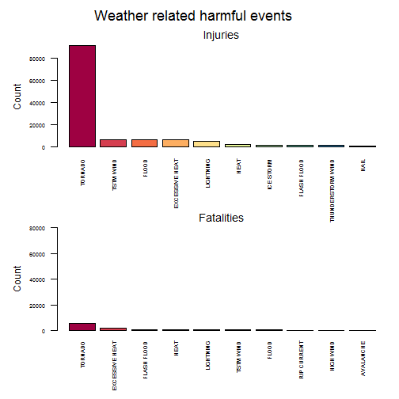
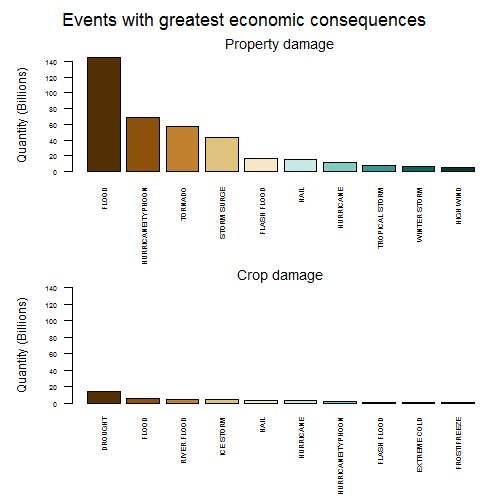

```r
---
title: Health and economic consequences from significant meteorological events in
  USA
output: pdf_document
---
```

```
## Error: <text>:2:15: unexpected symbol
## 1: ---
## 2: title: Health and
##                  ^
```


#Synopsis
In this document we will asses the effect of weather related events either those which are harmful to the people (cause of injuries and fatalties) or those which carry a cost due to property and crop damage. We analyze the data from the [ U.S. National Oceanic and Atmospheric Administration's (NOAA) storm database](http://www.nws.noaa.gov/directives/) and explore such effects across USA. We therefore conclude:

* Accros the United States the most harmful weather phenomena is the **Tornado** both in number of injuries and casualties.
* The major impact in property and crop damage from these extraordinary meteorological events is due to **floods** (highest *property damage costs*) and **drought** (highest *crop damage costs*).  

Thus this analysis of the NOAA database (link to the analyzed database can be found [here](https://d396qusza40orc.cloudfront.net/repdata%2Fdata%2FStormData.csv.bz2)) sheds light on both in healthy and economic repercussion of this weather events.

#Data Processing
In this section we will describe the command executed in R to download and read the file into R and later we will describe how the data obtained is tidied and processed to be suitable to analysis (Which we will see in the results section)

##Obtaining and loading the data

```r
# Downloading the file and documentation
fileURL <- "https://d396qusza40orc.cloudfront.net/repdata%2Fdata%2FStormData.csv.bz2"
docURL <- "https://d396qusza40orc.cloudfront.net/repdata%2Fpeer2_doc%2Fpd01016005curr.pdf"

if(!file.exists("./repdata%2Fdata%2FStormData.csv.bz2")) {
        download.file(fileURL, destfile = "repdata%2Fdata%2FStormData.csv.bz2")
}

if(!file.exists("./repdata%2Fpeer2_doc%2Fpd01016005curr.pdf")) {
        download.file(docURL, destfile = "./stormdata.pdf")
}

#Loading data into R
stormdata <- read.csv("repdata%2Fdata%2FStormData.csv.bz2")

#Loading neccesary packages
library(dplyr)
library(RColorBrewer)
```

##Processing the data
Since the names of variables are not in an easy way to work with, we will modificed them:
* The names of the variables seem to have a strange format:

```r
names(stormdata)
```

```
##  [1] "STATE__"    "BGN_DATE"   "BGN_TIME"   "TIME_ZONE"  "COUNTY"    
##  [6] "COUNTYNAME" "STATE"      "EVTYPE"     "BGN_RANGE"  "BGN_AZI"   
## [11] "BGN_LOCATI" "END_DATE"   "END_TIME"   "COUNTY_END" "COUNTYENDN"
## [16] "END_RANGE"  "END_AZI"    "END_LOCATI" "LENGTH"     "WIDTH"     
## [21] "F"          "MAG"        "FATALITIES" "INJURIES"   "PROPDMG"   
## [26] "PROPDMGEXP" "CROPDMG"    "CROPDMGEXP" "WFO"        "STATEOFFIC"
## [31] "ZONENAMES"  "LATITUDE"   "LONGITUDE"  "LATITUDE_E" "LONGITUDE_"
## [36] "REMARKS"    "REFNUM"
```
* We will process these names in order to be easy to work with (NOTE:_These steps are a personal preference, the data can be analized without these steps_):

```r
cnames <- names(stormdata)
cnames <- gsub("_", ".", cnames)
cnames <- tolower(cnames)
cnames[1] <- "state"
cnames[cnames == "longitude."] <- "longitude.e"
cnames #Lest see how it looks now
```

```
##  [1] "state"       "bgn.date"    "bgn.time"    "time.zone"   "county"     
##  [6] "countyname"  "state"       "evtype"      "bgn.range"   "bgn.azi"    
## [11] "bgn.locati"  "end.date"    "end.time"    "county.end"  "countyendn" 
## [16] "end.range"   "end.azi"     "end.locati"  "length"      "width"      
## [21] "f"           "mag"         "fatalities"  "injuries"    "propdmg"    
## [26] "propdmgexp"  "cropdmg"     "cropdmgexp"  "wfo"         "stateoffic" 
## [31] "zonenames"   "latitude"    "longitude"   "latitude.e"  "longitude.e"
## [36] "remarks"     "refnum"
```

```r
names(stormdata) <- cnames
```
* Now we will substract the variables we are interested in:

```r
data <- stormdata[, c("bgn.date", "evtype", "fatalities", "injuries", "propdmg", "propdmgexp", "cropdmg", "cropdmgexp")]
```
* We will prepare the data to analyze and plot the results regarding to harmful effects on human populations: 

```r
#Clean the data out of unnecessary rows
harmful <- data[(!is.na(data$injuries) & data$injuries > 0) | (!is.na(data$fatalities) & data$fatalities > 0), c("evtype", "injuries", "fatalities")]
```
* And now we will procedure to process the data in order to analyze the ecomony impact derived from weather events:
1. We need to merge the variables propdmg and propdmgexp. We first take a look to propdmgexp:

```r
prop <- data[(!is.na(data$propdmg) & data$propdmg > 0), c("evtype", "propdmg", "propdmgexp")]
levels(prop$propdmgexp)
```

```
##  [1] ""  "-" "?" "+" "0" "1" "2" "3" "4" "5" "6" "7" "8" "B" "h" "H" "K"
## [18] "m" "M"
```
2. And now the variables cropdmgexp:

```r
crop <- data[(!is.na(data$cropdmg) & data$cropdmg > 0), c("evtype", "cropdmg", "cropdmgexp")]
levels(crop$cropdmgexp)
```

```
## [1] ""  "?" "0" "2" "B" "k" "K" "m" "M"
```

* We will assume that the factors "K" (and k), "B" (and b), "M" (and m) and "H" (and h) stand for Thoundsan, Billions, Millions and Hundreds respectively (the rest will be associated to 1 as a value), which in combination with the values stored in the prop/cropdmg variable will give us the absulte values:

```r
# We will combine first the variables propdmg and propdmgexp
prop$propdmgexp <- as.character(prop$propdmgexp)
prop[prop$propdmgexp == "" |
             prop$propdmgexp == "-" | 
             prop$propdmgexp == "?" |
             prop$propdmgexp == "+" |
             prop$propdmgexp == "0" |
             prop$propdmgexp == "1" |
             prop$propdmgexp == "2" |
             prop$propdmgexp == "3" |
             prop$propdmgexp == "4" |
             prop$propdmgexp == "5" |
             prop$propdmgexp == "6" |
             prop$propdmgexp == "7" |
             prop$propdmgexp == "8",
     c("propdmgexp")
             ] <- "1"
prop[prop$propdmgexp == "H" | prop$propdmgexp == "h", c("propdmgexp")] <- 10^2
prop[prop$propdmgexp == "M" | prop$propdmgexp == "m", c("propdmgexp")] <- 10^6
prop[prop$propdmgexp == "B" , c("propdmgexp")] <- 10^9
prop[prop$propdmgexp == "K" , c("propdmgexp")] <- 10^3
prop$propdmgexp <- as.numeric(prop$propdmgexp)
prop <- mutate(prop, totaldmg = propdmg * propdmgexp) %>% select(evtype, totaldmg)

# And now the same with cropdmg and cropdmgexp
crop$cropdmgexp <- as.character(crop$cropdmgexp)
crop[crop$cropdmgexp == "" |
             crop$cropdmgexp == "?" |
             crop$cropdmgexp == "0" |
             crop$cropdmgexp == "2",
     c("cropdmgexp")] <- "1"
crop[crop$cropdmgexp == "B", c("cropdmgexp")] <- 10^9
crop[crop$cropdmgexp == "K" | crop$cropdmgexp == "k", c("cropdmgexp")] <- 10^3
crop[crop$cropdmgexp == "M" | crop$cropdmgexp == "m", c("cropdmgexp")] <- 10^6
crop$cropdmgexp <- as.numeric(crop$cropdmgexp)
crop <- mutate(crop, totaldmg = cropdmg * cropdmgexp) %>% select(evtype, totaldmg)
```

##Results
This section compromissed two basic question detailed below.

1. **Across the United States, which types of events (as indicated in the _evtype_ variable) are most harmful with respect to population health?**

We first look at the data we have processed to get an idea how it looks:

```r
#Arranging the evtype data for injuries and fatalities
harmful <- group_by(harmful, evtype)
harmfuli <- summarise(harmful, injuries = sum(injuries)) %>% arrange(desc(injuries))
harmfulf <- summarise(harmful, fatalities = sum(fatalities)) %>% arrange(desc(fatalities))

#Make us an idea of how the data look before plotting
head(harmfuli, 10)
```

```
## Source: local data frame [10 x 2]
## 
##               evtype injuries
##               (fctr)    (dbl)
## 1            TORNADO    91346
## 2          TSTM WIND     6957
## 3              FLOOD     6789
## 4     EXCESSIVE HEAT     6525
## 5          LIGHTNING     5230
## 6               HEAT     2100
## 7          ICE STORM     1975
## 8        FLASH FLOOD     1777
## 9  THUNDERSTORM WIND     1488
## 10              HAIL     1361
```

```r
head(harmfulf, 10)
```

```
## Source: local data frame [10 x 2]
## 
##            evtype fatalities
##            (fctr)      (dbl)
## 1         TORNADO       5633
## 2  EXCESSIVE HEAT       1903
## 3     FLASH FLOOD        978
## 4            HEAT        937
## 5       LIGHTNING        816
## 6       TSTM WIND        504
## 7           FLOOD        470
## 8     RIP CURRENT        368
## 9       HIGH WIND        248
## 10      AVALANCHE        224
```

And since we want to see the most harmful ones we can select the first 10:

```r
#Selecting the 10 most harmful events in both data variables
harmfulimost <- harmfuli[1:10,]
harmfulfmost <- harmfulf[1:10,]
```


```r
par(mfrow=c(2,1), mar = c(5, 5, 2, 0), oma = c(1, 0, 2, 1))

with(harmfulimost, barplot(injuries, main = "Injuries", font.main = 1, ylab = "Count", cex.names = .6, cex.axis = .6, names.arg = evtype, las = 2, col = brewer.pal(10, "Spectral")))

with(harmfulfmost, barplot(fatalities, main = "Fatalities", font.main = 1, cex.names = .6, ylab = "Count", cex.axis = .6, ylim = c(0, 80000), names.arg = evtype, las = 2, col = brewer.pal(10, "Spectral")))

mtext("Weather related harmful events", font.main = 1, cex = 1.5, outer = TRUE)
```



The answer seems clear: **Tornados** are the most deathly and dangerous weather events.

2. **Across the United States, which types of events have the greatest economic consequences?**

```r
#Summarising the results
prop <- group_by(prop, evtype)
props <- summarize(prop, totaldmg = sum(totaldmg)) %>% arrange(desc(totaldmg))
crop <- group_by(crop, evtype)
crops <- summarize(crop, totaldmg = sum(totaldmg)) %>% arrange(desc(totaldmg))

#Now see how it looks
head(props, 10)
```

```
## Source: local data frame [10 x 2]
## 
##               evtype     totaldmg
##               (fctr)        (dbl)
## 1              FLOOD 144657709807
## 2  HURRICANE/TYPHOON  69305840000
## 3            TORNADO  56937160779
## 4        STORM SURGE  43323536000
## 5        FLASH FLOOD  16140812067
## 6               HAIL  15732267543
## 7          HURRICANE  11868319010
## 8     TROPICAL STORM   7703890550
## 9       WINTER STORM   6688497251
## 10         HIGH WIND   5270046295
```

```r
head(crops, 10)
```

```
## Source: local data frame [10 x 2]
## 
##               evtype    totaldmg
##               (fctr)       (dbl)
## 1            DROUGHT 13972566000
## 2              FLOOD  5661968450
## 3        RIVER FLOOD  5029459000
## 4          ICE STORM  5022113500
## 5               HAIL  3025954473
## 6          HURRICANE  2741910000
## 7  HURRICANE/TYPHOON  2607872800
## 8        FLASH FLOOD  1421317100
## 9       EXTREME COLD  1292973000
## 10      FROST/FREEZE  1094086000
```

```r
#and we will select the most destructive ones
propmost <- props[1:10,]
cropmost <- crops[1:10,]
```


```r
par(mfrow=c(2,1), mar = c(6, 5, 2, 0), oma = c(1, 0, 2, 1))

with(propmost, barplot(totaldmg/1000000000, main = "Property damage", font.main = 1, ylab = "Quantity (Billions)", cex.names = .6, cex.axis = .6, names.arg = evtype, las = 2, col = brewer.pal(10, "BrBG")))

with(cropmost, barplot(totaldmg/1000000000, main = "Crop damage", font.main = 1, cex.names = .6, ylab = "Quantity (Billions)", cex.axis = .6, ylim = c(0, 140), names.arg = evtype, las = 2, col = brewer.pal(10, "BrBG")))

mtext("Events with greatest economic consequences", font.main = 1, cex = 1.5, outer = TRUE)
```



Here **Flood** is the main event causing property damage while **Drought** is responsable of the highest costs in crop damage
```

